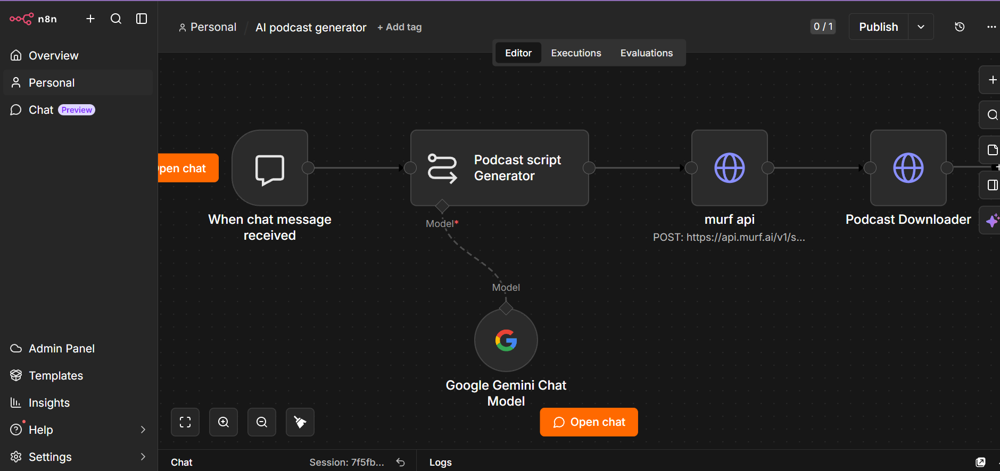

#  AI Podcast Generator

An end-to-end AI podcast generation workflow built with **n8n**, **Google Gemini**, and **Murf AI**.

##  Features

- Generates podcast scripts using Google Gemini
- Converts scripts into natural-sounding speech with Murf AI
- Downloads the generated audio automatically
- Simple, modular n8n workflow

##  Tech Stack

- n8n
- Google Gemini
- Murf AI
- HTTP Request Node

##  Workflow

Import the `workflow.json` file into n8n.

##  Setup

1. Import the workflow into n8n.
2. Add your Google Gemini credentials.
3. Replace `YOUR_MURF_API_KEY` with your own Murf AI API key.
4. Execute the workflow.

##  Workflow Screenshot

##  License

This project is licensed under the MIT License.
